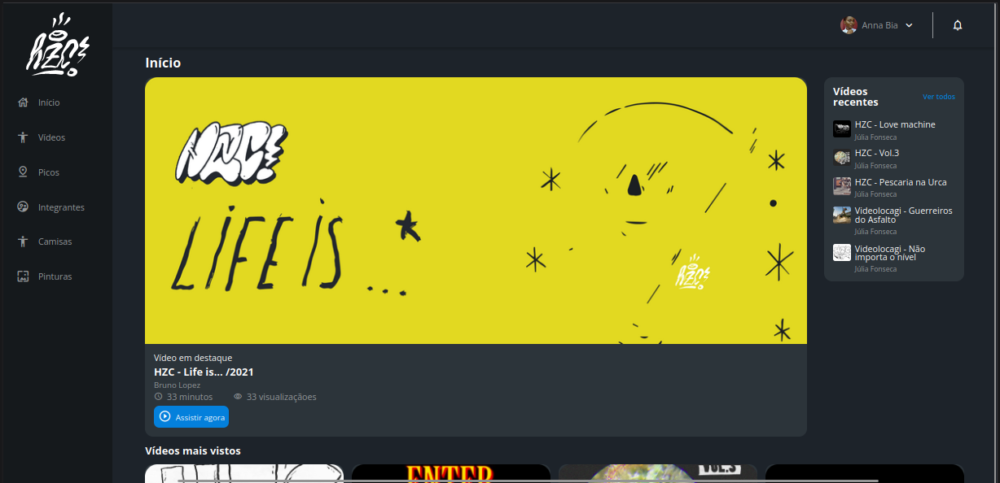
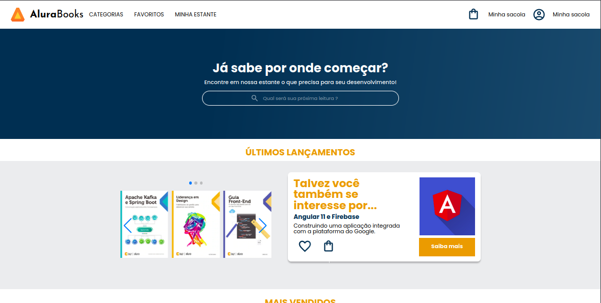

# Layouts modernos para a Web - Alura ⭐

"Um site moderno é também aquele que dá suporte a uma diversidade de tamanhos, 
formatos e resoluções de telas, ou seja, deve ser responsivo. Hoje, o uso da Web por um smartphone já é maior que por um computador, 
portanto isso torna imprescindível sabermos como criar sites priorizando esse contexto e conhecer quais técnicas do HTML e CSS 
facilitam esse desenvolvimento web mobile."

Diante desse contexto, neste projeto desenvolvi três páginas responsivas, reforçando as minhas habilidades no HTML e CSS, além da abordagem
mobile-first.

Tive como base o curso da Alura, dividido em 3 partes. 

Os layouts das páginas podem ser visualizados a seguir.

## Layout

HZC - Página de Skate          
:-------------------------:|
  |

Alura+            |         
:-------------------------:|
  |

AluraBooks           |        
:-------------------------:|
  |

## Link para Deploy

[HZC](https://css-alura-fff6-3r07ulp35-annatrajano.vercel.app/) 

[Alura+](https://css-alura.vercel.app/) 

[AluraBooks](https://css-alura-y2ev.vercel.app/) 

## Certificado

Certificado            |         
:-------------------------:|
  |

## Habilidades Desenvolvidas

 - Flexbox e Grid;
 - Abordagem mobile-first ;

 
 ## Referências
[HTML Element Reference](https://www.w3schools.com/TAGS/default.asp) 
[CSS Reference](https://www.w3schools.com/cssref/index.php) 
[HTML & CSS](https://cursos.alura.com.br/formacao-html-e-css) 
[CSS: Grids e tabelas com responsividade na Web](https://www.alura.com.br/artigos/como-fazer-grids-e-a-responsividade-na-web) 
[Flexbox CSS: Guia Completo, Elementos e Exemplos](https://www.alura.com.br/artigos/css-guia-do-flexbox) 
